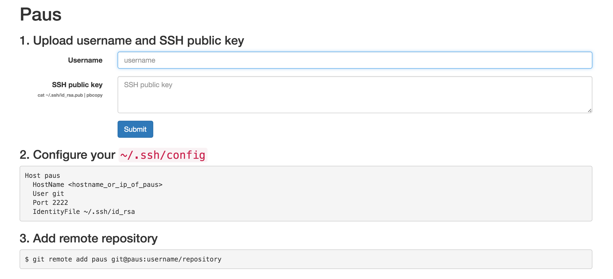

# paus-frontend

Web frontend of [Paus](https://github.com/dtan4/paus)



## Usage

``` bash
$ PAUS_BASE_DOMAIN=pausapp.com PAUS_ETCD_ENDPOINT=http://127.0.0.1:2379 paus-frontend
```

## Environment variables

| Key                  | Required | Description                                    | Default                 | Example                 |
|----------------------|----------|------------------------------------------------|-------------------------|-------------------------|
| `PAUS_BASE_DOMAIN`   | Required | Base domain for application URL                |                         | `pausapp.com`           |
| `PAUS_ETCD_ENDPOINT` |          | Endpoint of etcd cluster                       | `http://127.0.0.1:2379` | `http://127.0.0.1:2379` |
| `PAUS_URI_SCHEME`    |          | URI scheme of application URL (`http`|`https`) | http                    | `http`                  |

## Development

Go 1.5 or higher is required.
`GO15VENDOREXPERIMENT=1` must be set with Go 1.5.

``` bash
$ make deps
$ make build
$ bin/paus-frontend
```
