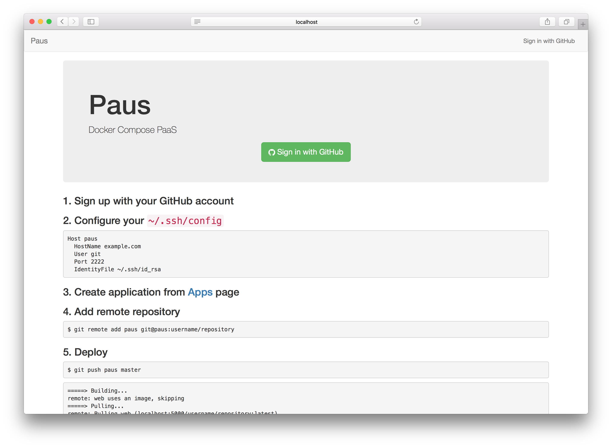

# paus-frontend

Web frontend of [Paus](https://github.com/dtan4/paus)



## Usage

``` bash
$ BASE_DOMAIN=pausapp.com ETCD_ENDPOINT=http://127.0.0.1:2379 paus-frontend
```

## Environment variables

| Key             | Required | Description                                | Default | Example               |
|-----------------|----------|--------------------------------------------|---------|-----------------------|
| `BASE_DOMAIN`   | Required | Base domain for application URL            |         | pausapp.com           |
| `ETCD_ENDPOINT` | Required | Endpoint of etcd cluster                   |         | http://127.0.0.1:2379 |
| `URI_SCHEME`    |          | URI scheme of application URL (http/https) | http    | http                  |

## Development

``` bash
$ make deps
$ make build
$ bin/paus-frontend
```
